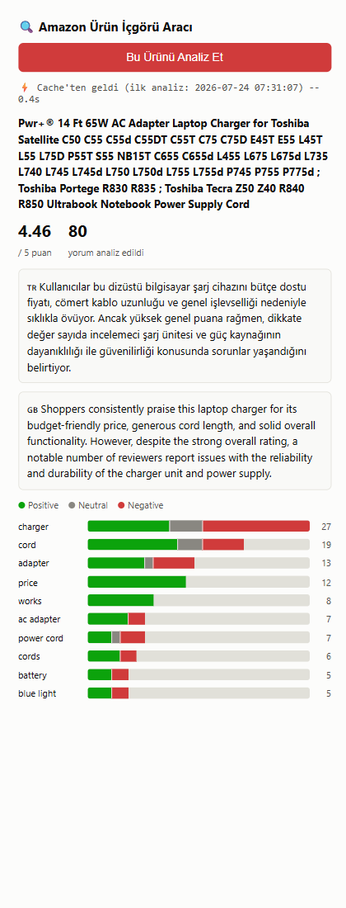
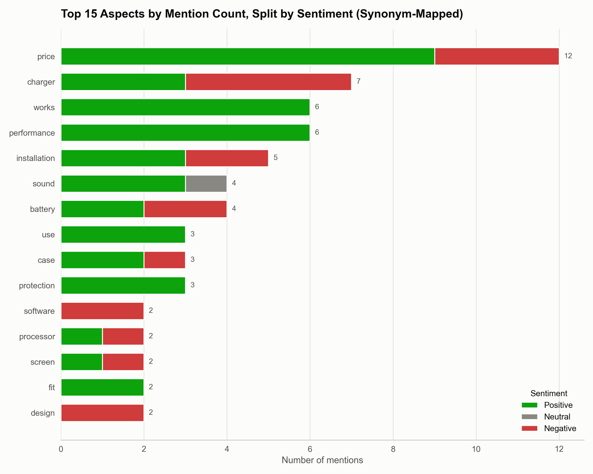

# Amazon Ürün İçgörü Aracı

[](https://github.com/10urok10/amazon-review-absa-insight/actions/workflows/ci.yml)

On-demand aspect-based sentiment analysis for Amazon product reviews. Give it a
product, and it tells you what reviewers actually praise and complain about at
the feature level — especially when that contradicts the overall star rating.

> A product can sit at 4.5 stars while a specific part of it (say, the
> charger) is a recurring complaint buried inside hundreds of reviews. This
> tool surfaces that instead of making you read all of them.

**The browser extension is the primary way to use this** — a floating button
injected directly into any Amazon product page (no dataset required), with an
in-page results panel. The screenshot below is the toolbar popup, which shares
the exact same rendering code (and so the exact same look) as that in-page
panel — real cached output, not a mockup:





## How it works

```
ASIN ──▶ SQLite cache ──▶ hit? return instantly (no GPU, no LLM call)
              │
              ▼ miss
   get review text (dataset lookup, or scraped live)
              │
              ▼
   pyabsa ATEPC: aspect extraction + sentiment, per review
              │
              ▼
   aggregate per-aspect sentiment counts (synonym-mapped)
              │
              ▼
   Gemini: aggregated stats → short natural-language insight (English + Turkish)
              │
              ▼
        write-through to cache
```

All three interfaces below share this exact pipeline (`insight_engine.py`) —
there is no duplicated logic between them.

| Interface | Use case |
|---|---|
| `analyze_product.py` (CLI) | Scriptable, one ASIN at a time |
| `app.py` (Streamlit) | Search Amazon products already in the static dataset by title |
| `browser_extension/` + `extension_server.py` | Any live Amazon product page — reads reviews directly from your own browser session, no dataset required |

## Setup

```bash
conda create --name amazon_absa python=3.10 -y
conda activate amazon_absa

# CUDA-enabled torch (adjust cu128 to match your GPU/driver if needed)
pip install torch --index-url https://download.pytorch.org/whl/cu128

pip install -r requirements.txt
```

Get a free Gemini API key at [aistudio.google.com/apikey](https://aistudio.google.com/apikey),
then:

```bash
cp .env.example .env   # fill in GEMINI_API_KEY
```

### Data (one-time)

Requires the [Amazon Electronics reviews + metadata dump](http://jmcauley.ucsd.edu/data/amazon/)
(`reviews_Electronics.json`, `meta_Electronics.json`) in the project root — not
included in this repo (multi-GB).

```bash
python preprocess.py            # → processed_full_dataset.parquet (~7.8M reviews)
python build_product_index.py   # → product_index.parquet (search index)
```

## Usage

```bash
# CLI
python analyze_product.py --asin B0001234
python analyze_product.py --asin B0001234 --force-refresh   # bypass cache

# Web UI
streamlit run app.py

# Browser extension (for products not in the static dataset)
python extension_server.py      # local backend, keep running
# then: chrome://extensions → Developer mode → Load unpacked → select browser_extension/
# on any Amazon product page, either click the toolbar icon, or use the floating
# button the extension injects directly into the page (auto-badges if the
# product is already cached)
```

## Testing

```bash
pip install -r requirements-dev.txt
pytest -v
```

Covers the GPU/API-free logic: aspect aggregation + synonym mapping, the
bilingual insight response parser, the SQLite cache (including schema
migration), and product search. pyabsa inference and the Gemini call itself
are not unit-tested (would require the model/network at test time) — treat
`analyze_product.py --asin <known-good-asin>` as the integration smoke test.

## Evaluation

pyabsa's ATEPC model is used off-the-shelf (not fine-tuned) — see
[`annotation_guidelines.md`](annotation_guidelines.md) and
[`build_gold_standard.py`](build_gold_standard.py) for the methodology behind
this. A gold-standard sample (stratified across star ratings, hand-annotated)
puts aspect-extraction around **P≈0.88 / R≈0.90 / F1≈0.89**, and sentiment
accuracy given a correctly-extracted aspect around **0.99**. Treat this as a
rough directional estimate, not a citable benchmark — it's a single
non-blind annotator's pass, not independently verified. Three follow-up
attempts to improve on it (rule-based post-processing, an alternate pyabsa
checkpoint, and fine-tuning on an independent labeled dataset) were tried and
measured; all three made things worse, so the project intentionally keeps the
unmodified "english" checkpoint.

## Known limitations

- **The ABSA model is off-the-shelf** — see Evaluation above for the honest,
  rough accuracy signal available so far. Treat its output as a strong
  heuristic, not ground truth.
- **The browser extension scrapes Amazon's rendered DOM**, which changes over
  time; the CSS selectors in `browser_extension/scraper.js` may need updating
  if Amazon changes its review page markup.
- **Aspect synonym mapping (`SYNONYM_MAP` in `insight_engine.py`) is a small,
  manually curated list** — related terms not in it are counted as distinct
  aspects.

## Stack

polars · pyabsa (ATEPC) · PyTorch (CUDA) · Gemini API · Streamlit · Altair ·
Flask · SQLite · Manifest V3 browser extension · ruff · pytest · GitHub Actions
